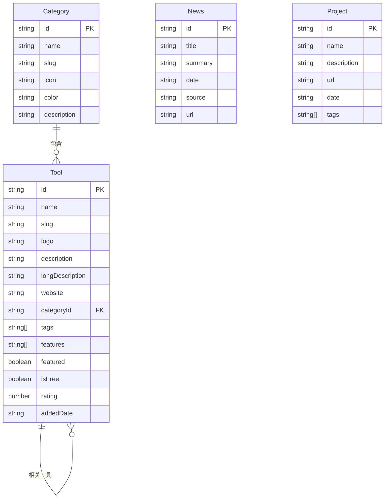

# AI工具收录网站 - 技术架构文档

## 1. 架构设计

纯前端单页应用，无后端服务，数据来自本地 Mock（TS 模块）。

```mermaid
flowchart TB
    subgraph "前端层 Frontend"
        "React 18 应用" --> "页面路由 (React Router)"
        "页面路由" --> "首页 / 分类页 / 详情页 / 资讯页 / 项目页"
    end
    subgraph "数据层 Data"
        "本地 Mock 数据 (TS 模块)" --> "工具数据 tools.ts"
        "本地 Mock 数据 (TS 模块)" --> "分类数据 categories.ts"
        "本地 Mock 数据 (TS 模块)" --> "资讯数据 news.ts"
        "本地 Mock 数据 (TS 模块)" --> "项目数据 projects.ts"
    end
    "前端层" --> "数据层"
```

## 2. 技术说明
- 前端：React@18 + tailwindcss@3 + vite
- 初始化工具：vite (npm create vite@latest)
- 路由：react-router-dom@6
- 图标：lucide-react
- 动效：CSS 动画 + framer-motion (可选，轻量使用)
- 后端：无
- 数据库：无（本地 Mock 数据）

## 3. 路由定义
| 路由 | 用途 |
|-------|---------|
| `/` | 首页：Hero 搜索 + 分类导航 + 精选/最新工具 + 资讯 + 项目 |
| `/category/:slug` | 分类列表页：按分类筛选工具 |
| `/tool/:id` | 工具详情页：工具详细介绍 |
| `/news` | 每日资讯页 |
| `/projects` | 最新项目页 |
| `*` | 404 页面 |

## 4. 数据模型

### 4.1 数据模型定义



### 4.2 数据定义
- 使用 TypeScript interface 定义数据结构，导出常量数组。
- 在 `src/data/` 目录下分别维护 `categories.ts`、`tools.ts`、`news.ts`、`projects.ts`。

## 5. 目录结构
```
src/
  components/      # 通用组件 (Navbar, Footer, ToolCard, CategoryCard, SearchBar 等)
  pages/           # 页面 (Home, Category, ToolDetail, News, Projects, NotFound)
  data/            # Mock 数据
  hooks/           # 自定义 hooks (useSearch 等)
  App.tsx          # 根组件 + 路由
  main.tsx         # 入口
  index.css        # 全局样式 + Tailwind
```
